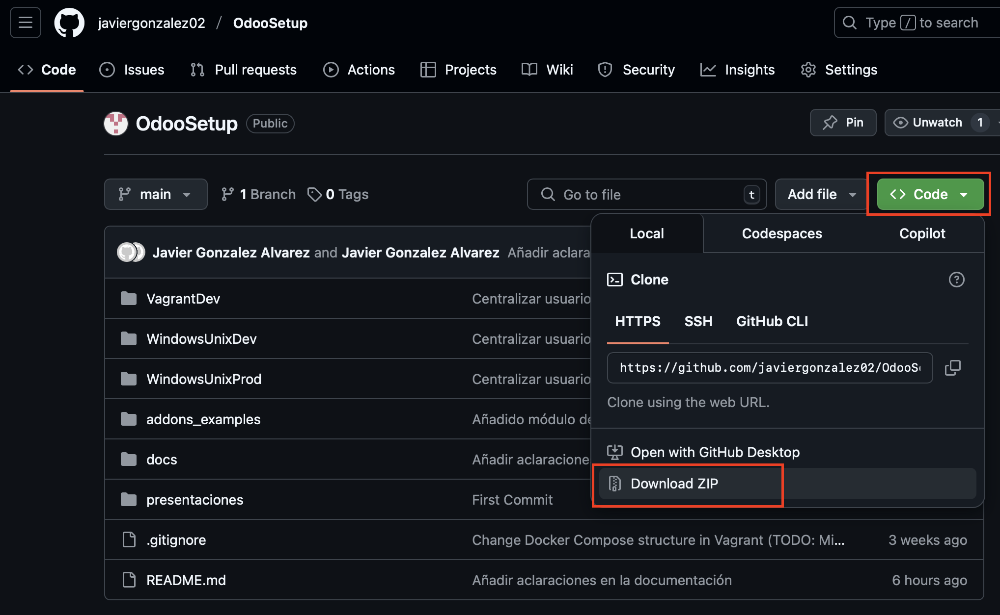

# Instalación y Uso de Odoo

Bienvenido al repositorio para la instalación y uso de Odoo.  
Aquí encontrarás toda la documentación necesaria para:

- Desarrollar módulos usando **Vagrant** (recomendado exclusivamente para desarrollo).
- Instalar Odoo utilizando **Docker** (compatible con Docker Desktop en Windows/Mac y Docker en Linux).
- Conocer el uso básico de Odoo y realizar copias de seguridad.

---

## Índice

- [Primeros pasos](#primeros-pasos)
- [Instalación con Vagrant](#instalación-con-vagrant)
- [Instalación con Docker](#instalación-con-docker)
- [Uso Básico y Mantenimiento](#uso-básico-y-mantenimiento)
- [Desarrollo de Módulos de Odoo](#desarrollo-de-módulos-de-odoo)

---

## Primeros pasos

Antes de comenzar, asegúrate de obtener el repositorio. Puedes hacerlo de dos formas:

- Con Git (recomendado):
  Ejecuta en tu terminal:

```bash
    git clone https://github.com/javiergonzalez02/OdooSetup
```

- Descarga manual:
Si no tienes Git instalado, descarga el repositorio manualmente:


---

## Instalación con Vagrant

Nota: Esta opción está orientada exclusivamente al desarrollo de módulos.

Para configurar tu entorno de desarrollo con Vagrant, consulta la guía completa: 
[VER EXPLICACIÓN](./docs/VagrantSetupOdoo.md)

---

## Instalación con Docker

Requisitos:

Windows/Mac: Docker Desktop
Linux: Docker Engine
Para obtener la guía detallada, revisa:

[VER EXPLICACIÓN](./docs/DockerOdooSetup.md)

---

## Uso Básico y Mantenimiento

Esta sección explica cómo utilizar Odoo y realizar tareas de mantenimiento, incluyendo la realización de copias de seguridad.
Consulta la guía completa en:
[VER EXPLICACIÓN](./docs/UsoYMantenimiento.md)

---

## Desarrollo de Módulos de Odoo

Para conocer a fondo el desarrollo de módulos de Odoo, referirse a la carpeta [presentaciones](./presentaciones/)