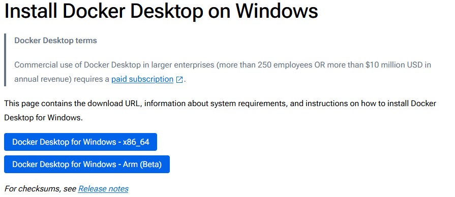
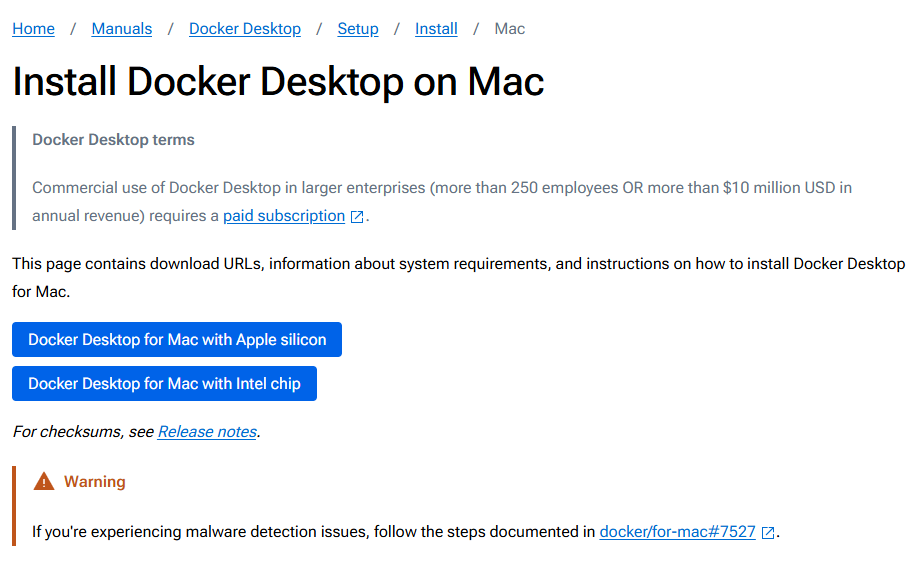

# Instalación de Docker sin Vagrant

Esta guía te muestra cómo instalar el entorno de Docker en distintos sistemas operativos sin utilizar Vagrant. Dependiendo de tu objetivo, utiliza una de las siguientes carpetas:

- **Desarrollo:** `./Dev`
- **Producción:** `./Prod`

---

## 1. Selecciona el Entorno

Navega a la carpeta correspondiente según el uso que le darás:
- Para **desarrollo**, utiliza `./Dev`.
- Para **producción**, utiliza `./Prod`.

---

## 2. Instalación del Entorno Docker

### En Windows

- **Docker Desktop:**  
  Se debe instalar Docker Desktop. Aunque, si lo prefieres, se recomienda optar por la instalación de [Vagrant](./VagrantSetupOdoo.md).  
  Consulta la guía oficial para la instalación de Docker Desktop en Windows:  
  [Guía oficial de instalación](https://docs.docker.com/desktop/setup/install/windows-install/)

  

---

### En macOS

- **Docker Desktop:**  
  En macOS es posible instalar Docker Desktop, y por lo general se presentan menos inconvenientes que en Windows. En caso de dificultades, también se puede optar por la instalación de [Vagrant](./VagrantSetupOdoo.md).

  

---

### En Linux

- **Docker Engine:**  
  En Linux se recomienda instalar Docker Engine. Sigue la guía oficial y selecciona la instrucción correspondiente a la distribución de Linux que estés utilizando:  
  [Guía de instalación de Docker Engine](https://docs.docker.com/engine/install/)

- **NOTA: después de instalar docker, es posible que debas añadir tu usuario al grupo de docker para obtener los permisos necesarios para ejecutarlo. Ejemplo UBUNTU:**

  ```bash
  sudo usermod -aG docker $USER
  ```

  ```bash
  newgrp docker
  ```

---

## 3. Uso y Mantenimiento

Una vez instalado Docker, revisa la guía completa para aprender a utilizar Odoo y gestionar el mantenimiento, incluyendo copias de seguridad y otras operaciones:  
[VER EXPLICACIÓN DE USO](UsoYMantenimiento.md)
