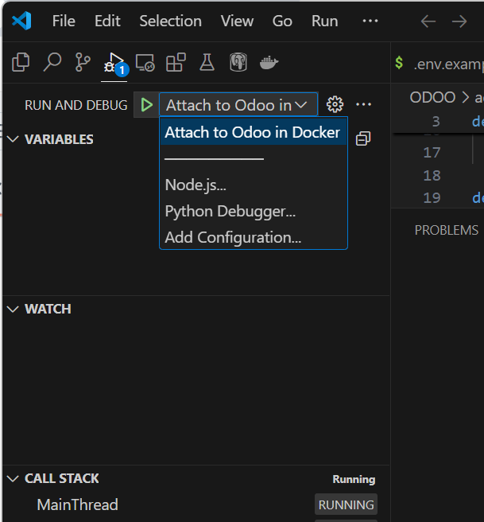

# Guía Básica de Uso

## Índice
1. [Crear el archivo .env](#1-crear-el-archivo-env)
2. [Uso de Docker](#2-uso-de-docker)
3. [Restauración de la base de datos inicial](#3-restauración-de-la-base-de-datos-inicial)
4. [Acceso a la interfaz de Odoo](#4-acceso-a-la-interfaz-de-odoo)
5. [Uso de la aplicación](#5-uso-de-la-aplicación)
6. [Debug con Vs Code](#6-debug-en-vscode)
7. [Copia de seguridad de la base de datos](#6-copia-de-seguridad-de-la-base-de-datos)
8. [Extraer código de los módulos descargados para desarrollo](#7-extraer-código-de-los-módulos-descargados-para-desarrollo)
---

## 1. Crear el archivo .env

**Importante**: Este paso es obligatorio, sin importar el método de instalación que elijas.

1. Copiar el archivo `.env.example` a `.env`:
   - En Unix:
     ```bash
     cp .env.example .env
     ```
   - En Windows:
     ```bash
     copy .env.example .env
     ```

2. Edita los usuarios y contraseñas según tus necesidades (se recomienda solo modificar las contraseñas).

---

## 2. Uso de Docker

Una vez establecido el entorno para Docker, utiliza los siguientes comandos:

- **Levantar los contenedores con logs:**
  ```bash
  docker compose up
  ```

- **Levantar los contenedores en segundo plano (sin logs):**
  ```bash
  docker compose up -d
  ```

- **Levantar los contenedores en segundo plano (sin logs) EN MODO DESARROLLO:**
NOTA: Es importante que, si se cambia algo del Dockerfile, se use este comando para reconstruir la imagen
  ```bash
  docker compose up -d --build
  ```
  
- **Ver logs de los contenedores:**
  ```bash
  docker compose logs -f
  ```

- **Detener contenedores:**
  ```bash
  docker compose down
  ```

- **Detener y eliminar contenedores y volúmenes (en caso de error):**
  ```bash
  docker compose down -v
  ```

---

## 3. Restauración de la base de datos inicial

Si deseas usar la base de datos con el set up inicial, sigue estos pasos:

1. **Restaurar carpeta filestore:**

  >**IMPORTANTE:** Si estás utilizando Vagrant, realiza este paso antes de levantar los contenedores. Si ya los tienes levantados ejecuta el comando `docker compose down -v`. Cuando finalices de copiar la carpeta, ya podrás levantar los contenedores con `docker compose up -d`

   - Comando para Unix:
    ```bash
    cp -r ./ODOO_INITIAL_SETUP ./ODOO
    ```

   - Comando para Windows:
    ```bash
    xcopy ".\ODOO_INITIAL_SETUP" ".\ODOO" /E /I
    ```

2. **Entrar al contenedor de la base de datos:**
   ```bash
   docker compose exec db bash
   ```

3. **Crear una nueva base de datos vacía:**
   ```bash
   createdb -U odoo -O odoo odoo
   ```

4. **Salir del contenedor:**
   ```bash
   exit
   ```

5. **Obtener el ID del contenedor de la base de datos:**
   ```bash
   docker ps
   ```

6. **Copiar el archivo de respaldo al contenedor:**
   ```bash
   docker cp ./initial_setup.sql <ID_CONTENEDOR>:/ 
   ```

7. **Restaurar la copia de seguridad:**
   - Vuelve a entrar al contenedor:
     ```bash
     docker compose exec db bash
     ```
   - Restaura la copia de seguridad:
     ```bash
     psql -U odoo -d odoo < ./initial_setup.sql
     ```
    **IMPORTANTE:** No tocar nada hasta que el proceso finaliza. Tardará unos segundos.   

   - Sal del contenedor:
     ```bash
     exit
     ```

> **Imagen:** Ejemplo de importación de base de datos  
> 

- **Usuario para iniciar sesión:**
  - Correo: admin
  - Contraseña: 1234

> **NOTA:** Se recomienda crear la base de datos desde cero, ya que la instalación de módulos es muy simple.

---

## 4. Acceso a la interfaz de Odoo

Con el contenedor levantado, accede a Odoo a través del siguiente enlace:  
[http://localhost:8069/](http://localhost:8069/)

- **Creación de la base de datos desde cero:**  
  Aparecerá una ventana para establecer usuario, contraseña, correo, master password e idioma.  
  > **Imagen:** Creación de Base de Datos  
  > 

- **Si se importó la base de datos:**  
  Verás una pantalla para seleccionar la base de datos llamada "odoo". Se debe esperar hasta que se ejecute el script entero antes de seleccionar la base de datos. Una vez seleccionada, se mostrará la pantalla de inicio de sesión similar a la anterior.  
  > **Imagen:** Selección de Base de Datos  
  > 

---

## 5. Uso de la aplicación

Una vez dentro de la app, encontrarás la siguiente interfaz:

> **Imagen:** Pantalla de Apps  
> 

- **Instalación de aplicaciones:**  
  Pulsa el botón "activar" para instalar las aplicaciones requeridas.
  
- **Navegación:**  
  En el icono superior izquierdo podrás elegir la aplicación que deseas usar de forma intuitiva.  
  > **Imagen:** Menú de Apps  
  > 

---

## 6. Debug en VsCode

Para realizar Debug del código en VsCode, sigue estos pasos:

Puntos a tener en cuenta antes de comenzar: 

- El docker-compose.yml del set up de producción no está preparado para este fin, solo el docker-compose.yml de la versión de desarrollo.
- Tanto Vagrant como Docker solamente son compatibles con este debug
- Si utilizas el Debug, la interfaz de Odoo no se mostrará hasta que completes el 3er paso de este tutorial.
- Si en algún momento quieres dejar de hacer debug. Deshaz el contenedor con `docker compose down odoo -v` y vuelve a levantarlo con `docker compose up -d --build`

1. En tu archivo docker-compose.yml:

Descomenta las siguientes líneas:

```bash
#  - '5678:5678'
```

```bash
# command: python3 -m debugpy --listen 0.0.0.0:5678 --wait-for-client /usr/bin/odoo --dev=all --db_host=${HOST} --db_password=${DB_PASSWORD}
```

Y comenta o elimina la siguiente línea:

```bash
command: --dev=all
```

2. Luego, teniendo la carpeta `.vscode` de la carpeta `DevVisualStudioDebug` en la raiz del proyecto de VsCode para que sea detectado automáticamente. Selecciona:

(Nota) Es recomendable copiar la carpeta DevVisualStudioDebug en otro directorio y utilizarlo de manera independiente a este proyecto para mejor experiencia de uso.

`Run > Start Debugging`

3. Al seleccionar lo anterior, verás la siguiente pantalla:



Pulsa el botón verde para comenzar. Una vez lo hagas, podrás comenzar con el debug como en cualquier otro IDE usando break points.

---

## 7. Copia de seguridad de la base de datos

Sigue estos pasos para realizar una copia de seguridad:

### 7.1 Crear la copia de seguridad con `pg_dump`

1. Conéctate al contenedor de la base de datos:
   ```bash
   docker compose exec db bash
   ```

2. Detén el servicio de PostgreSQL:
   ```bash
   service postgresql stop
   ```

3. Crea la copia de seguridad:
   ```bash
   pg_dump -U odoo odoo > backup.sql
   ```

4. Reinicia el servicio de PostgreSQL:
   ```bash
   service postgresql start
   ```

5. Sal del contenedor:
   ```bash
   exit
   ```

### 7.2 Copiar el archivo de copia de seguridad a la máquina anfitriona

Utiliza el siguiente comando (reemplaza `./ruta/` con la ruta donde desees guardar el archivo):
```bash
docker compose cp db:./backup.sql ./ruta/backup.sql
```

NOTA: La carpeta `filestore` dentro de la carpeta `ODOO` debe ser guardada junto con el dump de la base de datos.

- Comando para Unix:
```bash
mkdir -p ./ODOO_BACKUP/filestore
cp -r ./ODOO/filestore/ ./ODOO_BACKUP/filestore/
```

- Comando para Windows:
```bash
xcopy ".\ODOO\filestore" ".\ODOO_BACKUP\filestore" /E /I
```

## 8. Extraer código de los módulos para desarrollo

Para poder obtener el código de los modulos oficiales, se debe ejecutar el siguiente comando en el host. La única función que tiene esto es para que, en caso de que se vaya a ampliar un módulo, entender su funcionamiento.

```bash
docker exec odoo tar czvf - \
  --ignore-failed-read \
  --exclude='*/static/lib/fontawesome*' \
  --exclude='*/static/lib/underscore*' \
  --exclude='*/static/fonts/google*' \
  --exclude='*/static/src/fonts*' \
  /usr/lib/python3/dist-packages/odoo/addons/ | tar xzf - -C ./ODOO/addons_lib
```

NOTA: Se han excluido ciertos archivos que han dado error y se ha ignorado el error de fallo de lectura. En caso de que necesites uno de estos simplemente cópialo individualmente: ```docker cp odoo:/usr/lib/python3/dist-packages/odoo/addons/web/static/lib/fontawesome ./ODOO/addons_lib/fontawesome```
