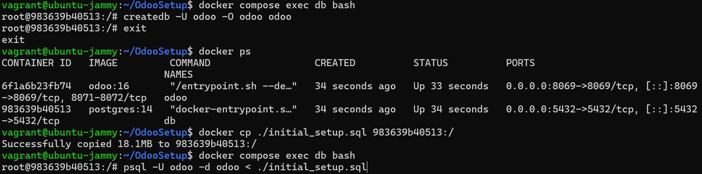
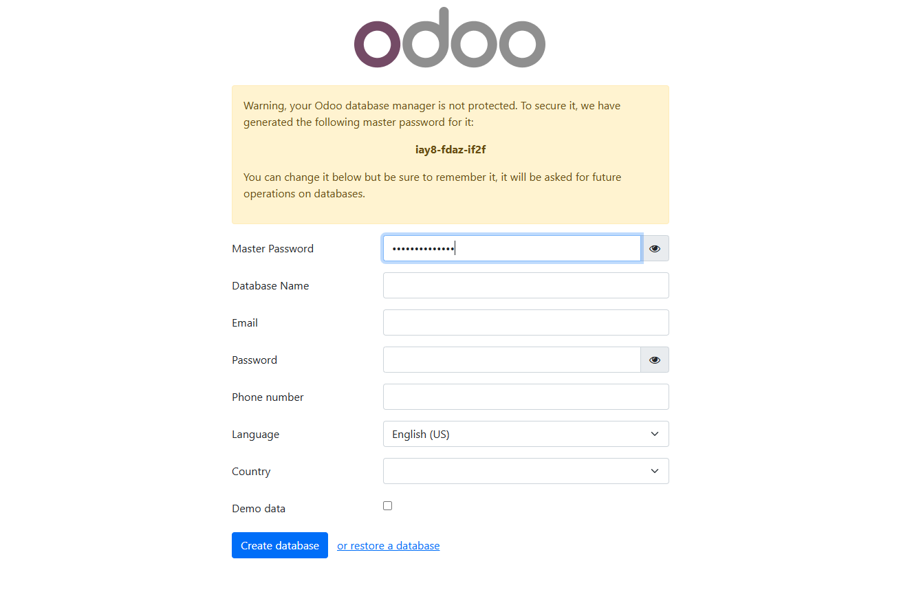
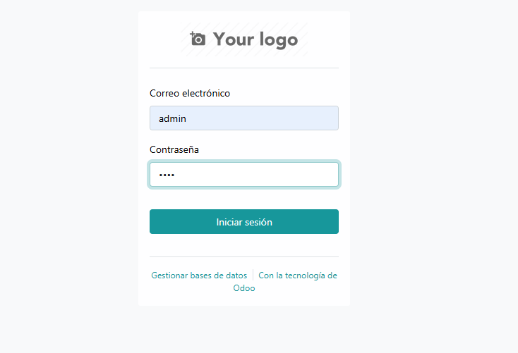
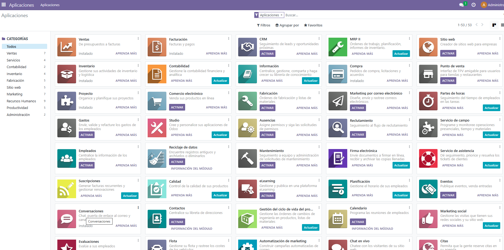
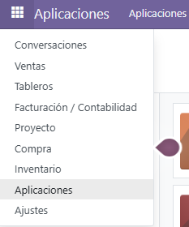

# Guía Básica de Uso

## Índice
1. [Crear el archivo .env](#1-crear-el-archivo-env)
2. [Uso de Docker](#2-uso-de-docker)
3. [Restauración de la base de datos inicial](#3-restauración-de-la-base-de-datos-inicial)
4. [Acceso a la interfaz de Odoo](#4-acceso-a-la-interfaz-de-odoo)
5. [Uso de la aplicación](#5-uso-de-la-aplicación)
6. [Copia de seguridad de la base de datos](#6-copia-de-seguridad-de-la-base-de-datos)
7. [Extraer código de los módulos base para desarrollo](#7-extraer-código-de-los-módulos-base-para-desarrollo)
---

## 1. Crear el archivo .env

**NOTA:** Se deberán seguir estos pasos independientemente de la opción de instalación escogida.

1. Copiar el archivo `.env.example` a `.env`:
   - En Unix:
     ```bash
     cp .env.example .env
     ```
   - En Windows:
     ```bash
     copy .env.example .env
     ```

2. Edita los usuarios y contraseñas según tus necesidades (se recomienda solo modificar las contraseñas).

---

## 2. Uso de Docker

Una vez establecido el entorno para Docker, utiliza los siguientes comandos:

- **Levantar los contenedores:**
  ```bash
  docker compose up
  ```

- **Eliminar contenedores y volúmenes en caso de error:**
  ```bash
  docker compose down -v
  ```

---

## 3. Restauración de la base de datos inicial

Si deseas usar la base de datos con el set up inicial, sigue estos pasos:

1. **Entrar al contenedor de la base de datos:**
   ```bash
   docker compose exec db bash
   ```

2. **Crear una nueva base de datos vacía:**
   ```bash
   createdb -U odoo -O odoo odoo
   ```

3. **Salir del contenedor:**
   ```bash
   exit
   ```

4. **Obtener el ID del contenedor de la base de datos:**
   ```bash
   docker ps
   ```

5. **Copiar el archivo de respaldo al contenedor:**
   ```bash
   docker cp ./initial_setup.sql <ID_CONTENEDOR>:/ 
   ```

6. **Restaurar la copia de seguridad:**
   - Vuelve a entrar al contenedor:
     ```bash
     docker compose exec db bash
     ```
   - Restaura la copia de seguridad:
     ```bash
     psql -U odoo -d odoo < ./initial_setup.sql
     ```
   - Sal del contenedor:
     ```bash
     exit
     ```

> **Imagen:** Ejemplo de importación de base de datos  
> 

- **Usuario para iniciar sesión:**
  - Correo: admin
  - Contraseña: 1234

> **NOTA:** Se recomienda crear la base de datos desde cero, ya que la instalación de módulos es muy simple.

---

## 4. Acceso a la interfaz de Odoo

Con el contenedor levantado, accede a Odoo a través del siguiente enlace:  
[http://localhost:8069/](http://localhost:8069/)

- **Creación de la base de datos desde cero:**  
  Aparecerá una ventana para establecer usuario, contraseña, correo, master password e idioma.  
  > **Imagen:** Creación de Base de Datos  
  > 

- **Si se importó la base de datos:**  
  Verás una pantalla para seleccionar la base de datos llamada "odoo". Se debe esperar hasta que se ejecute el script entero antes de seleccionar la base de datos. Una vez seleccionada, se mostrará la pantalla de inicio de sesión similar a la anterior.  
  > **Imagen:** Selección de Base de Datos  
  > 

---

## 5. Uso de la aplicación

Una vez dentro de la app, encontrarás la siguiente interfaz:

> **Imagen:** Pantalla de Apps  
> 

- **Instalación de aplicaciones:**  
  Pulsa el botón "activar" para instalar las aplicaciones requeridas.
  
- **Navegación:**  
  En el icono superior izquierdo podrás elegir la aplicación que deseas usar de forma intuitiva.  
  > **Imagen:** Menú de Apps  
  > 

---

## 6. Copia de seguridad de la base de datos

Sigue estos pasos para realizar una copia de seguridad:

### 6.1 Crear la copia de seguridad con `pg_dump`

1. Conéctate al contenedor de la base de datos:
   ```bash
   docker compose exec db bash
   ```

2. Detén el servicio de PostgreSQL:
   ```bash
   service postgresql stop
   ```

3. Crea la copia de seguridad:
   ```bash
   pg_dump -U odoo odoo > backup.sql
   ```

4. Reinicia el servicio de PostgreSQL:
   ```bash
   service postgresql start
   ```

5. Sal del contenedor:
   ```bash
   exit
   ```

### 6.2 Copiar el archivo de copia de seguridad a la máquina anfitriona

Utiliza el siguiente comando (reemplaza `./ruta/` con la ruta donde desees guardar el archivo):
```bash
docker compose cp db:./backup.sql ./ruta/backup.sql
```

### 6.3 Eliminar contenedores y limpiar directorios mapeados

```bash
docker compose down -v
sudo rm -rf dataPG/* sessions/* filestore/* addons/*
```

## 7. Extraer código de los módulos base para desarrollo

Para poder obtener el código de los modulos oficiales descargados, se debe ejecutar el siguiente comando en el host

```bash
docker cp odoo:/usr/lib/python3/dist-packages/odoo/addons/base ./ODOO/base_mirror
```