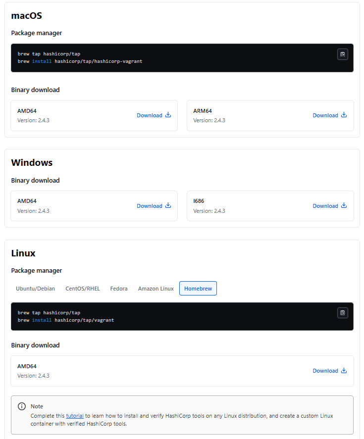
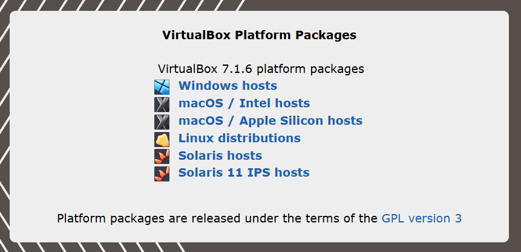

# ENTORNO DE DESARROLLO DE ODOO CON VAGRANT

1. INSTALACIÓN DE VAGRANT.
Guía de instalación oficial: https://developer.hashicorp.com/vagrant/downloads

Se deberá escoger la opción que se ajuste al sistema operativo que se esté usando. Permite tanto macOS, Windows o Linux.



2. INSTALACIÓN DE VIRTUAL BOX. Link oficial: https://www.virtualbox.org/wiki/Downloads

Se deberá escoger una opción de entre las siguientes.



3. En la carpeta en la que se encuentra el archivo 'Vagrantfile'. En este proyecto será la carpeta VagrantDev (En la cual se encuentra este documento). Ejecuta los siguientes comandos:

- Este comando levantará la Máquina virtual (La primera vez puede tardar unos minutos. Y es posible que, dependiendo de tu ordenador, debas abrir la aplicación de Virtual Box)

``` bash
vagrant up
```

- Este comando dará acceso a la Máquina Virtual a través de terminal
``` bash
vagrant ssh
```

4. Una vez dentro, se deberá acceder a la carpeta 'OdooSetup':
``` bash
cd OdooSetup/
```

